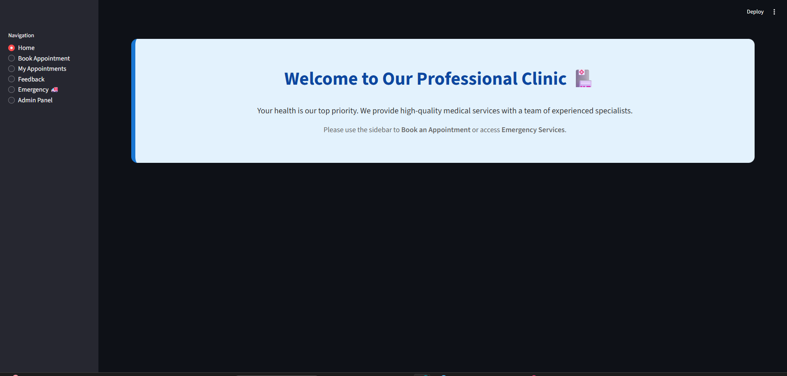
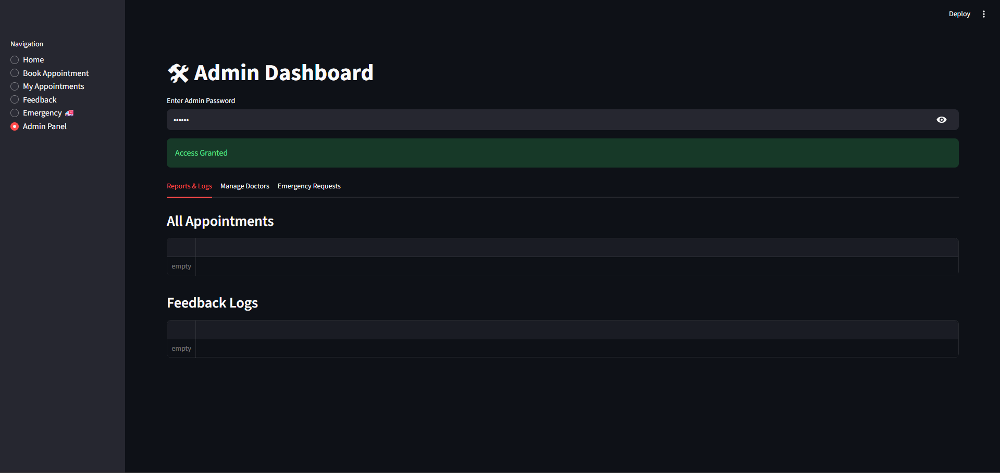

# Clinic Management System 
A collaborative medical administration system developed by a team of 10 members. This project features a web-based dashboard for managing patient appointments, doctor schedules, and emergency requests across 12 medical specialties.

### My Role & Contribution
I was responsible for the core **Admin Management Logic**. My work ensured the system handles complex administrative tasks securely and efficiently:
* **Admin Dashboard:** Developed the logic for adding, deleting, and updating doctor profiles and specialties (`Admin_menu.py`).
* **OOP Architecture:** Implemented foundational classes for Patients and Emergency services using inheritance.
* **Data Integration:** Managed how specialty data is handled and displayed for administrators.

### Project Preview
| Home Interface | Admin Control Panel |
|---|---|
|  |  |

### Technologies Used
* **Backend:** Python (OOP Principles).
* **Frontend:** Streamlit.
* **Data Handling:** Pandas.
